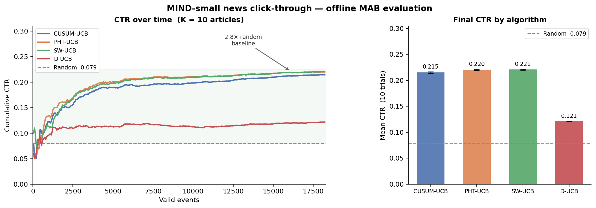
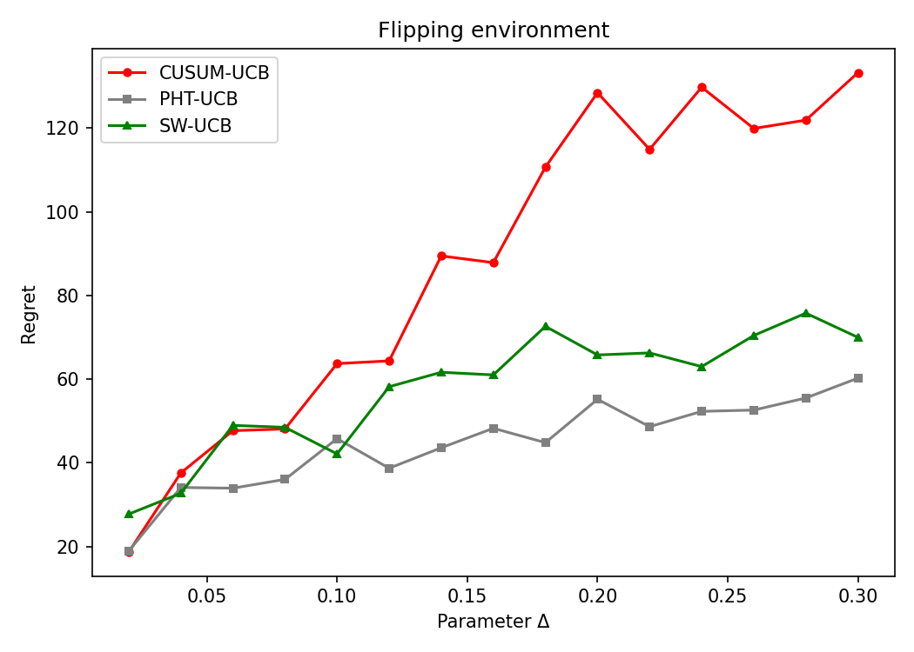
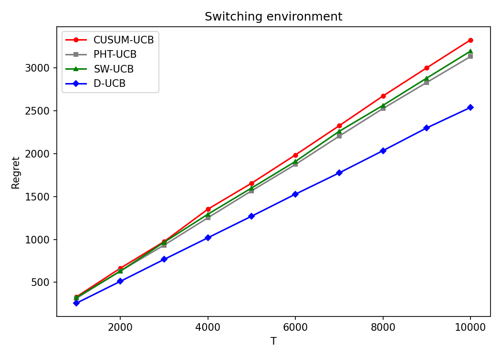
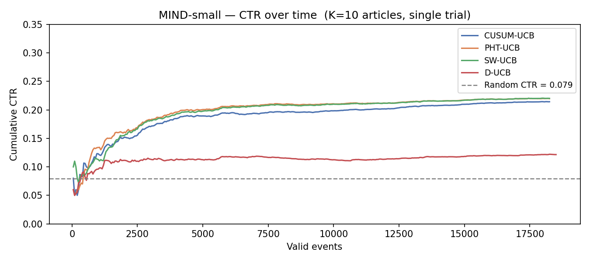
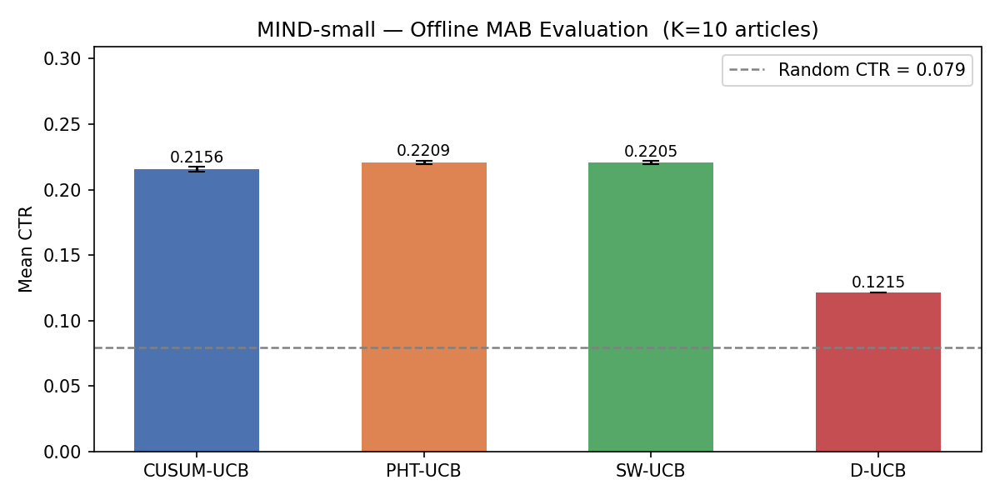
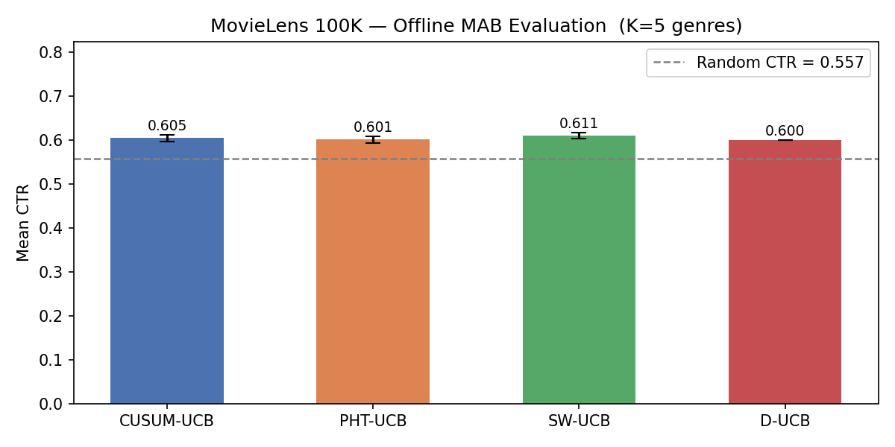

# Change-Detection in Multi-Armed Bandits



Standard UCB assumes the reward distributions are stationary. In the real world this isn't always the case. A news article's click-through rate drops once the story goes stale. This project is about what happens when you add change detectors to UCB algorithms: how well it works, and when it doesn't.

I originally implemented this in Wolfram Mathematica as a course project at IIT Madras, replicating experiments from Liu et al. (2018). This Python port adds D-UCB as a third algorithm and validates against real click-through data from Microsoft's MIND news dataset.

---

- [The problem](#the-problem)
- [Algorithms](#algorithms)
- [Synthetic experiments](#synthetic-experiments)
  - [Flipping environment](#flipping-environment)
  - [Switching environment](#switching-environment)
- [Real data: MIND news clicks](#real-data-mind-news-clicks)
- [Real data: MovieLens 100K](#real-data-movielens-100k)
- [Reference](#reference)

---

## The problem

A multi-armed bandit has K arms with unknown reward distributions. Standard UCB deals well with stationary rewards: pull an arm more and you grow more confident it's good. Non-stationarity breaks this, the best arm today might be the worst arm tomorrow, and UCB keeps exploiting stale historical data.

There are two strategies for handling it:

**Active:** Attach a change detector to each arm. When it fires, treat that arm as unknown and start fresh: reset its statistics, leave the others alone.

**Passive:** Forget old data deliberately. Keep only the last M observations (sliding window), or weight older ones less (geometric discounting). No explicit detection, just structured forgetting.

---

## Algorithms

### Change detectors

Both detectors watch whether an arm's reward distribution has shifted from a reference level.

**CUSUM** fixes the baseline from the first M observations. After burn-in it runs cumulative sum statistics and fires when either exceeds threshold h:

```
g⁺ₜ = max(0, g⁺ₜ₋₁ + (xₜ − μ₀ − ε))
g⁻ₜ = max(0, g⁻ₜ₋₁ + (μ₀ − xₜ − ε))
alarm if g⁺ₜ ≥ h or g⁻ₜ ≥ h
```

**PHT** (Page-Hinkley Test) is the same walk, but uses the running mean of all observations as the baseline rather than a fixed M-sample estimate. No burn-in required.

On alarm, that arm's history resets. Detectors are arm-independent: a change in arm 2 doesn't touch arms 1, 3, 4, 5.

### Bandit algorithms

| Algorithm | Type | Change Detection Method|
|---|---|---|
| CUSUM-UCB | Active | CUSUM detector per arm; resets arm on alarm |
| PHT-UCB | Active | PHT detector per arm; resets arm on alarm |
| SW-UCB | Passive | Sliding window of last M rewards per arm |
| D-UCB | Passive | Geometric discounting: older rewards weighted by γᵗ⁻ˢ |

All use UCB arm selection with exploration coefficient ξ = 1 (required for the regret bound). The active algorithms add a small forced-exploration probability α so they don't miss changes in arms they've stopped pulling.

---

## Synthetic experiments

### Flipping environment

In this environment, there are two arms. Arm 0 is always Bernoulli(0.5). Arm 1 cycles between 0.5 − Δ and 0.8 at deterministic changepoints T/3 and 2T/3.

Small Δ = hard (arms are similar)

Large Δ = easy (arm 1 is clearly better or worse)



Both active methods outperform SW-UCB, and the gap grows with Δ. When the arms are easy to distinguish the detector fires quickly after a change and resets cleanly. At small Δ the signal is weak, so it takes many samples to build up the walk statistic. Detection is slow and the advantage shrinks.

### Switching environment

Five arms. At each step, every arm independently redraws its mean from U[0,1] with probability β = 0.2. This is a hazard-function model: changepoints arrive continuously and randomly per arm.



Completely different story. D-UCB has roughly 25% lower regret than everything else. CUSUM and PHT barely improve over SW-UCB.

This can be explained by the calibration. The switching model's hazard rate β directly determines the optimal discount factor: γ = 1 − β = 0.8. D-UCB's effective memory is 1/(1 − γ) = 5 steps, exactly 1/β: the expected interval between changepoints. CUSUM needs M = 100 samples just for burn-in: far longer than the typical time between changes. By the time a detector accumulates enough evidence to fire, the distribution has already changed several more times. Smooth exponential forgetting with the right γ is simply a better fit for very high-frequency change.

---

## Real data: MIND news clicks

I ran the same algorithms on Microsoft's MIND-small dataset (156k impression logs, ~5.8M article display events). News CTR has natural non-stationarity: a story breaks, peaks quickly, then fades within days.

For evaluation I used rejection sampling (Li et al. 2010): at each step the bandit proposes an article arm; the event counts only if that matches the article that was actually displayed in the log. This gives an unbiased estimate of the algorithm's CTR without needing a live deployment.

Arms are the 10 most frequently displayed articles, covering ~181k events. The overall CTR for these articles is 7.9%.



All three UCB variants plateau around 20–22% CTR, roughly 2.8× the random baseline, within the first ~2000 valid events.



D-UCB, which won the switching environment, drops to 12.2% here. Two reasons. First, γ = 0.999 is too slow: it gives an effective memory of ~1000 steps, far too inert for articles that peak and fade within a few hundred impressions. Second, D-UCB has no forced exploration (no α term), so once it commits to an article it rarely re-explores and misses articles that have since become more popular. In the synthetic switching env this didn't matter because γ was tuned to match β exactly. Here there's no such prior.

PHT-UCB edges CUSUM-UCB slightly because news article CTR shifts tend to be abrupt (sudden break → fast fade), which PHT detects without needing a fixed burn-in period. CUSUM's M = 100 sample burn-in takes longer to establish the pre-change baseline.

---

## Real data: MovieLens 100K

MovieLens 100K contains 100k movie ratings from 943 users. I mapped it to a bandit problem by treating genres as arms (Drama, Action, Comedy, Crime, Adventure) and rewarding a positive rating (≥ 4 stars) as a click. Events are sorted by timestamp to get a temporal stream.



All algorithms hover around 60–62% CTR, barely above the 55.7% random baseline. The gap is much smaller than on MIND, for two reasons.

First, the arms lack differentiation. Each genre contains thousands of diverse movies, so the genre-level CTR averages out to something similar across arms, all roughly in the 50–60% range. There's no clearly dominant arm to exploit.

Second, the logging policy isn't random. Rejection sampling's validity requires that the log was collected by a uniform random policy over arms. MovieLens was collected under user self-selection: drama fans rate drama, action fans rate action. When the bandit picks "Drama" and gets a valid match, it's because a drama fan happened to be in the session. Every genre ends up looking equally good because each genre's valid events are biased toward users who already prefer it.

MIND was collected with a random display policy abd articles were shown randomly from a pool, so the evaluation there is cleaner.

---

## Reference

Liu, H., Dolan, E., Zhou, H., & Shroff, N. (2018). A Change-Detection based Framework for Piecewise-stationary Multi-Armed Bandit Problem. *IEEE Transactions on Neural Networks and Learning Systems*.
